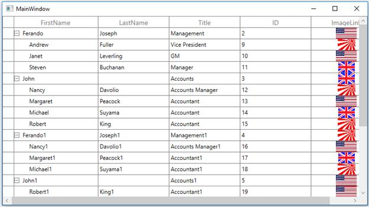

# How to load images in a cell in WPF / UWP TreeGrid?

This example illustrates how to load images in a cell in [WPF TreeGrid](https://www.syncfusion.com/wpf-controls/treegrid) and [UWP TreeGrid](https://www.syncfusion.com/uwp-ui-controls/treegrid) (SfTreeGrid).

You can add the image to TreeGrid cell by using [TreeGridTemplateColumn](https://help.syncfusion.com/cr/wpf/Syncfusion.UI.Xaml.TreeGrid.TreeGridTemplateColumn.html).

### XAML:
``` xml
<syncfusion:TreeGridTemplateColumn MappingName="ImageLink">
    <syncfusion:TreeGridTemplateColumn.CellTemplate>
          <DataTemplate>
               <Image Source="{Binding Path=ImageLink,
                      Converter={StaticResource converter}}"/>
          </DataTemplate>
    </syncfusion:TreeGridTemplateColumn.CellTemplate>
</syncfusion:TreeGridTemplateColumn>
```

### C#:
``` c#
public class StringToImageConverter : IValueConverter
{
    public object Convert(object value, Type targetType, object parameter, System.Globalization.CultureInfo culture)
    {
        string imagename = value as string;
        return new BitmapImage(new Uri(string.Format(@"..\..\Images\{0}", imagename), UriKind.Relative));
    }

    public object ConvertBack(object value, Type targetType, object parameter, System.Globalization.CultureInfo culture)
    {
        return null;
    }
}
```

